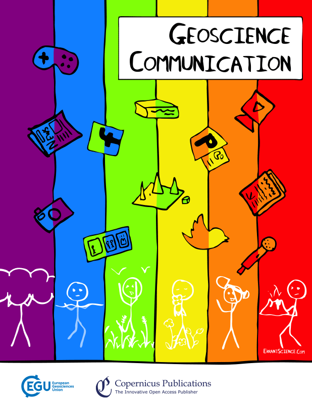

# Geoscience Communication

This repo is for hosting of materials relevant to the journal, [Geoscience Communication](https://www.geoscience-communication.net/). 

## Aims and Scope

Geoscience Communication (GC) is a journal to help share knowledge and give more "traditional" recognition to science communication in the geosciences. Science communication is used as an umbrella term by GC to cover all aspects of outreach, public engagement, widening participation, knowledge exchange, and any other initiatives within the scope of the journal. It can be thought of as any initiative which seeks to communicate an aspect of geoscience to a wider audience than the experts within that particular field.

For more, please see [Aims and Scope](Aims_and_Scope.md).

## Executive Editors

- Sam Illingworth (Chief Executive Editor) ([contact](mailto:s.illingworth@mmu.ac.uk))
- Iain Stewart
- Jon Tennant
- Kirsten van Elverfeldt

Find out more about our Editorial Board [here](https://www.geoscience-communication.net/editorial_board.html).

Follow us on [Twitter](https://twitter.com/EGU_GC)! 

